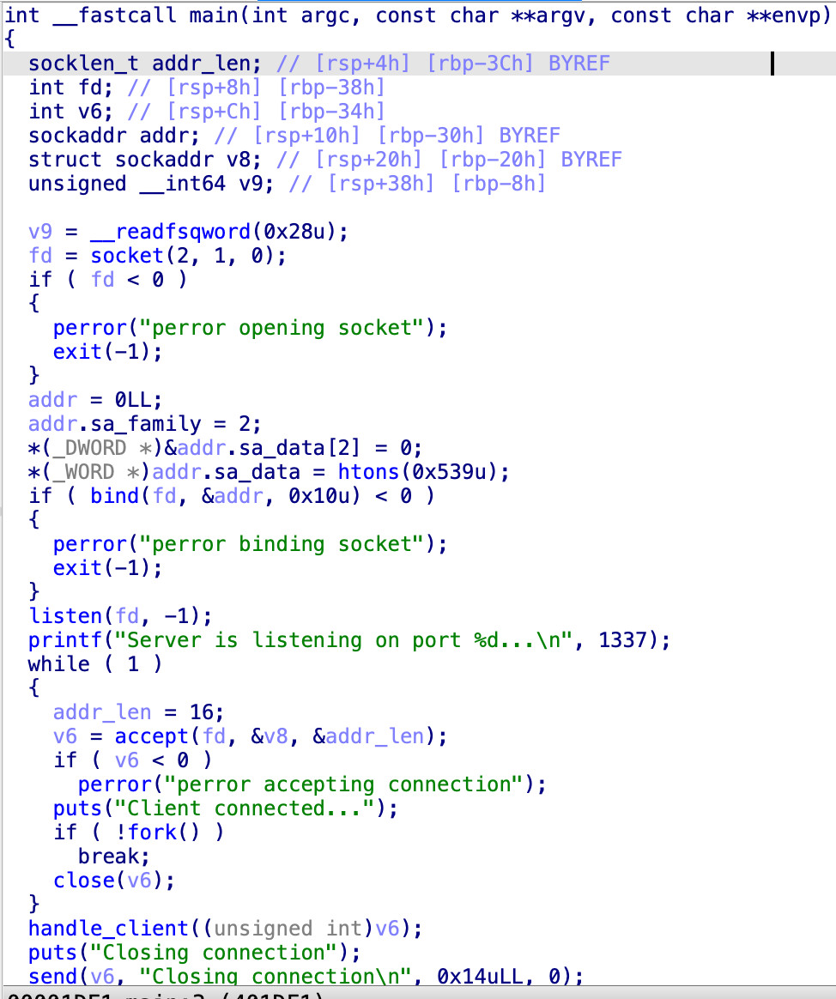
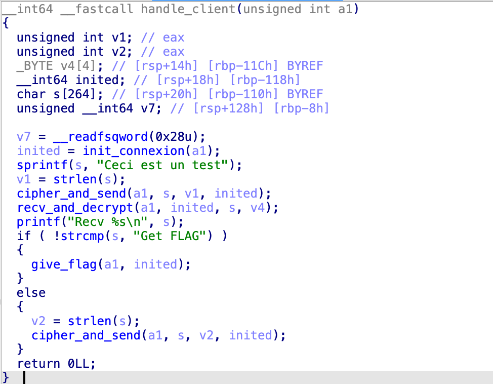
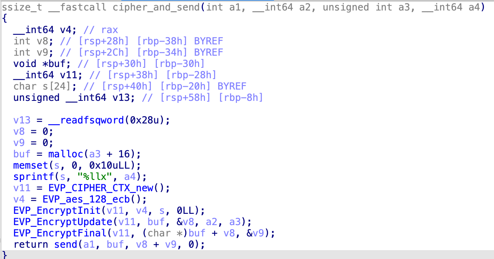
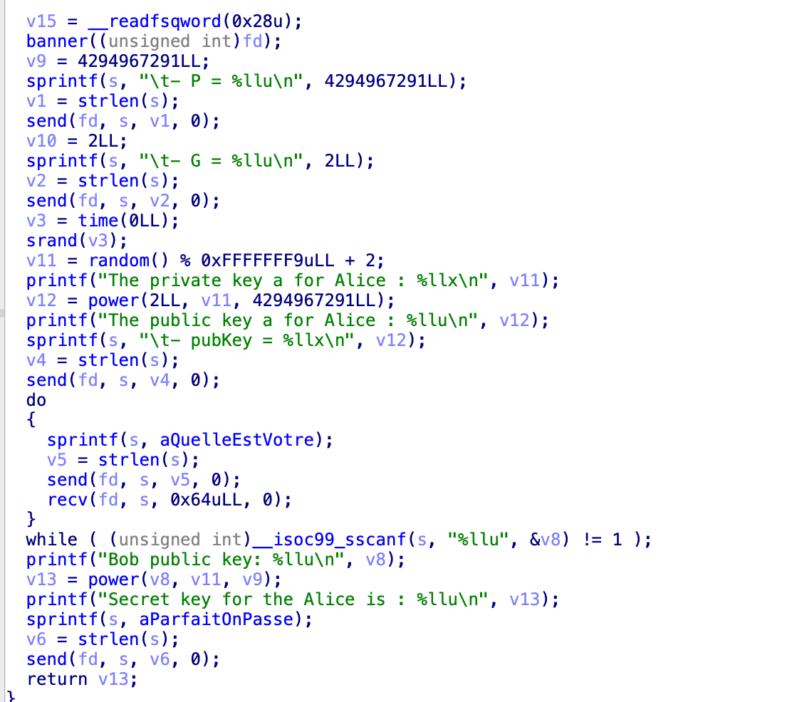
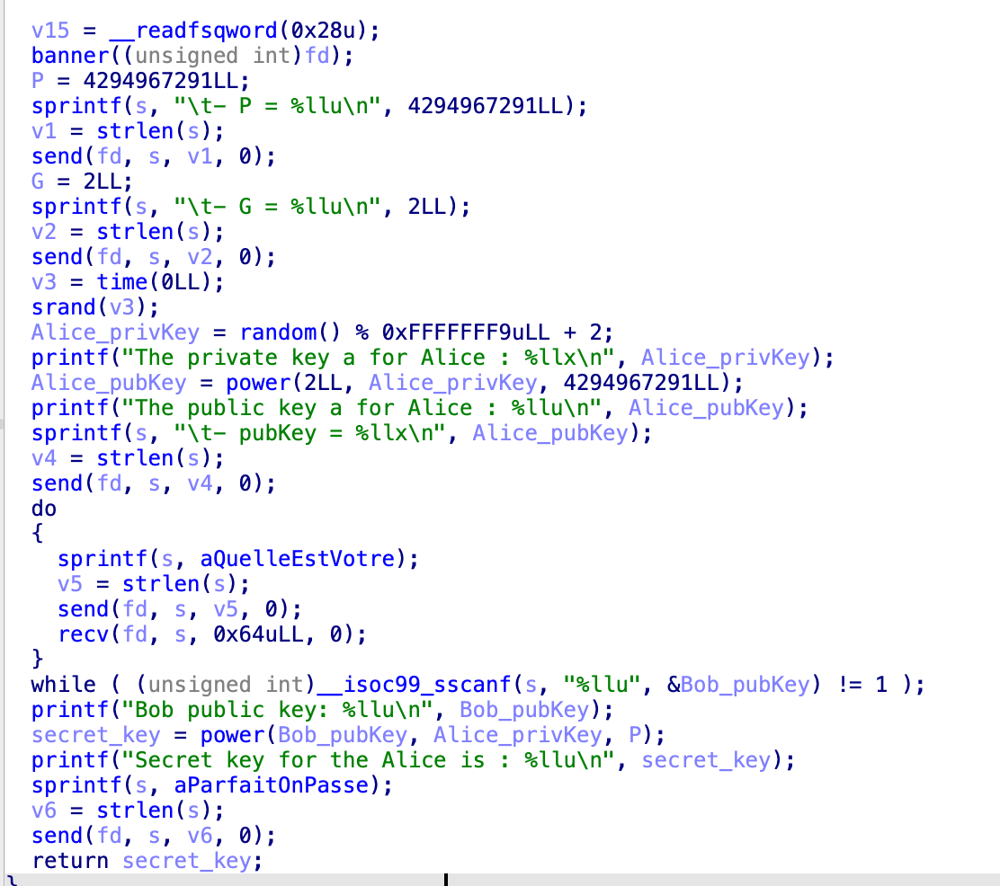
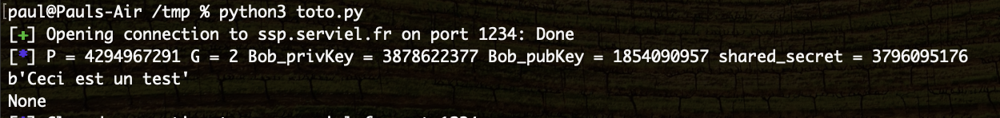

# SSP 1

Dans ce challenge, nous devons analyser le code d'un serveur pour comprendre comment communiquer avec.

Voici la fonction main



Le serveur écoute sur le port tcp 0x539 puis attend que des clients se connectent.  
Dès qu'une connexion est créé, il appelle la fonction `handle_client`



Si l'on en crois le nom des fonctions, il y a une phase d'initlisation de la connexion, puis il chiffre et envoie "Ceci est un test" au client.

Il attend ensuite de la donnée, la déchiffre et compare avec "Get FLAG".
Si cette comparaison réussie, il envoie le flag.

Commençons par regarder quel est le chiffrement utilisé dans `cipher_and_send`.



L'algorithme de chiffrement utilisé ici est AES en mode ECB.  
Ce chiffrement n'est pas considéré comme sûr car il est possible de faire de l'analyse fréquentiel pour récupérer de la donnée([example](https://bishopfox.com/blog/breaking-fortinet-firmware-encryption)).  
Mais ici on n'envoie et reçois que peu de données donc cela de devrait pas être un problème.

Pour chiffrer en AES ECB, on y a uniquement besoin d'une clé.
Ici la clé est donnée en 3e argument de `EVP_EncryptInit` (`s`).
Et elle provient de `sprintf` qui transforme `a4` en string.  
Donc la clé utilisée est un nombre et est le 4e argument de `cipher_and_send`.

On voit dans la fonction `handle_client` que ce nombre provient de la valeur de retour de `init_connexion`, regardons cette fonction.



Cette fonction fait pas mal de choses et l'on va commencer par renommer toutes les variables par rapport aux différents logs que l'on a.



On voit alors que la valeur de retour de cette fonction correspond à `secret_key`.  
`secret_key` est obtenue avec `power(Bob_pubKey, Alice_privKey, P);` où `P` est une constante, `Bob_pubKey` est récupérée du client (donc on la contrôle) et `Alice_privKey` est random.

Le serveur nous envoie `P`, `G` et `Alice_pubKey`.  
Avec ces trois informations, nous devrions être en capacité de créer `Bob_pubKey` tel quel l'on trouve le même `secret_key` que le server.

Ce genre de manipulation s'appelle un échange de clé, chaque partie se met d'accord sur des paramètres, génère un couple de clé publique/privée respectant certaines propriétés, s'échangent leurs clé publique et tombent par magie sur le même secret partagé.

En effectuant quelques recherches google, on se rend compte que l'échange de clé implémenté ici s'appelle [Diffie-Hellman](https://en.wikipedia.org/wiki/Diffie%E2%80%93Hellman_key_exchange).  

Pas besoin de comprendre les maths derrière, il n'y a qu'à réimplémenter le protocole.

```python
from pwn import *
from random import randint
from Crypto.Cipher import AES
from Crypto.Util.Padding import unpad, pad

io = remote('ssp.serviel.fr', 1234, ssl=True)

cipher = None

def init_connexion():
    global cipher
    io.recvuntil(b'P = ')
    P = int(io.recvline())

    io.recvuntil(b'G = ')
    G = int(io.recvline())

    io.recvuntil(b'pubKey = ')
    Alice_pubKey = int(io.recvline(), 16)

    # Create the private key
    Bob_privKey = randint(1, P-1)

    # Compute the public key
    Bob_pubKey = pow(G, Bob_privKey, P)

    # Compute the shared key
    shared_secret = pow(Alice_pubKey, Bob_privKey, P)

    io.sendlineafter(b'publique ? ', str(Bob_pubKey).encode())

    log.info(f"{P = } {G = } {Bob_privKey = } {Bob_pubKey = } {shared_secret = }")

    io.recvuntil(b'maintenant\n')
    key = f"{shared_secret:x}".encode().ljust(16, b'\0')
    cipher = AES.new(key, AES.MODE_ECB)
    
def recv_and_decrypt():
    ciphered = io.recv()
    print(unpad(cipher.decrypt(ciphered), 16))

init_connexion()
data = recv_and_decrypt()
print(data)
```



On récupère bien *"Ceci est un test"* qui a été chiffré par le serveur. Il n'y a plus qu'à demander le flag (voir client.py)