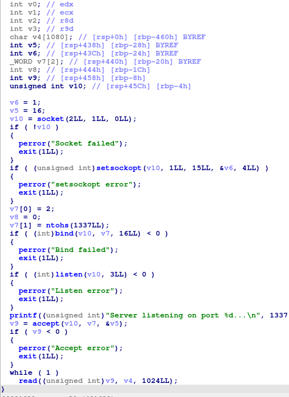
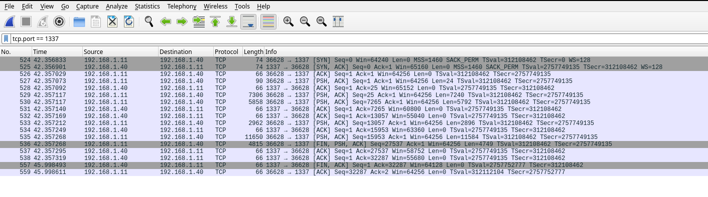
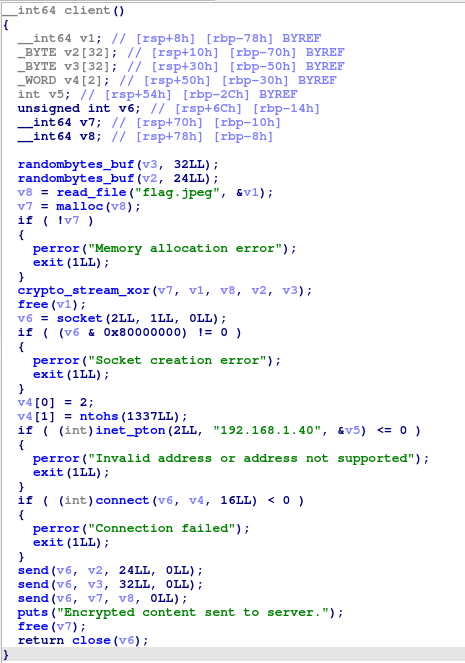

# Botnet

Ce challenge contient trois fichiers:  
- une souche
- un C2
- une capture réseau

On se doute que les deux binaires vont communiquer entre eux et que la capture réseau va permettre de récupérer les informations de ces échanges.

On commence par analyser le c2 dont voici le code principal

Le programme crée un socket tcp sur le port 1337.  
Il attend ensuite une connexion puis lis des données en boucle sans rien en faire. 

La seule information que nous apprend ce binaire est le port tcp sur lequel on cherche de la donnée.

Si on ouvre la capture réseau dans wireshark, on peut voir qu'il y a effectivement des échanges sur le port TCP 1337

Mais on se sait pas ce que contient cette donnée donc on va analyser la souche

Le programme appelle `randombytes_buf`,  récupère le contenu du fichier `flag.jpeg` puis le chiffre avec la fonction `crypto_stream_xor`.  
Cette fonction n'est pas rose donc elle ne provient pas d'une librairie récupérée dynamiquement.  

En revanche si l'on fait des recherches google avec son nom et/ou le nom des fonctions qu'elle appelle, on voit qu'elles proviennent de la librairie `libsodium`.  
Le programme a donc été compilé en statique.

Dans la [documentation](https://libsodium.gitbook.io/doc/advanced/stream_ciphers/xsalsa20) de cette librairie, on voit que `crypto_stream_xor` permet effectivement de chiffrer de la donnée mais demande un nonce et une clé en paramètre 4 et 5.  
Dans notre binaire, ce sont les variables v2 et v3 qui sont générées aléatoirement avec `randombytes_buf`.

Après ce chiffrement, il se connecte au serveur sur le port TCP 1337 et lui envoie le nonce, la clé et le chiffré.

Donc avec la capture réseau, on est capable de récupérer le nonce, la clé et la donnée chiffrée pour ensuite la déchiffrer non même. (voir solve.py)