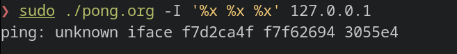
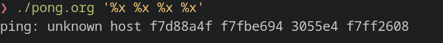
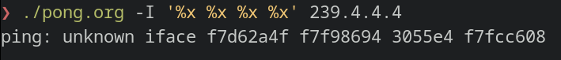
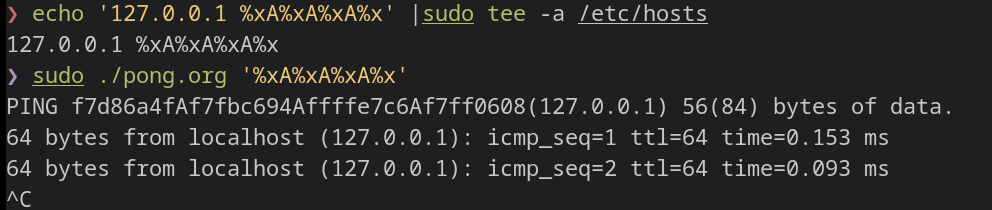
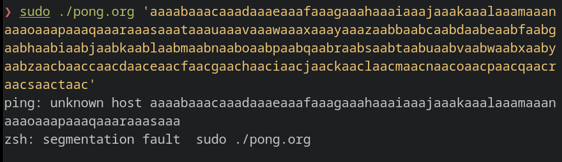
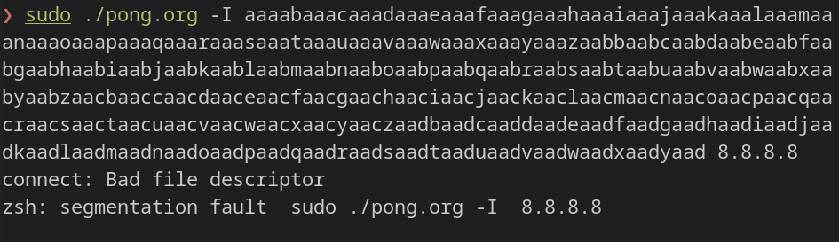

# Pong

Ce challenge est un challenge de recherche de vulnérabilités.  
Nous avons accès au code source ainsi qu'au binaire compilé.

Le code est assez conséquent ce qui nous oblige à changer la méthode habituelle de reverse.  
Car si l'on cherche à partir du main et à comprendre tout le programme en détail, on va vite se perdre dans masse de code.

Une possibilité pour aborder ce genre de code est de partir des fonctions connues pour être vulnérables en C puis regarder si l'on contrôlle la donnée qu'elles manipulent.  
Les trois grands types de fonction qe l'on va chercher sont:  
- les fonctions de formattage: `printf`, `sprintf`, ...
- les fonctions de récupération de données: `gets`, `read`, `scanf`, `fread`, ...
- les fonctions de mouvement de données: `strcpy`, `memcpy`, ...

## Format string

Commençons par la 1e catégorie car elles sont généralement les plus faciles à repérer.  
La vulnérabilité dans de type de fonction est lorsque l'utilisateur contrôle la chaine de format (1e argument de `printf`, 2nd argument de `sprintf`).  
En regardant toutes les utilisations de ces fonctions dans le code source, on tombe sur des lignes potentiellement vulnérables.  
On voit à la ligne 323 `fprintf(stderr, device);`. 
La chaine de fomat est la variable `device` donc si l'utilisateur contrôlle son contenu il s'agit d'une vulnérabilité.  
Cette variable est définie à la ligne 169 `device = strdup(optarg);` dans le `case 'I'`. 
Il s'agit de l'argument donné en ligne de commande avec `-I`.  

L'utilisateur contrôlle effectivement la chaine de format et est capable de récupérer de l'information (le contenu de la stack)

La même vulnérabilité est présente aux lignes 227, 258 et 486.  
Et voici leurs POC respectifs.

## Buffer overflow

La seconde catégorie de fonctions vulnérables est rapide vérifier car le programme n'attend aucune entrée utilisateur à part les arguments passés en ligne de commande.

Concernant la 3e catégorie, `strcpy` n'est appelée qu'une fois mais on remarque la fonction `safe_strcpy` qui est définie dans `ping_common.c` ligne 646.
Aucune vérification n'est apportée par cette version *"safe"*.  
Cette fonction est appellée à la ligne `215`, avec `*argv` comme source et `target` comme destination qui est une variable de taille fixe stockée dans la stack.  
Dans ce context `*argv` est l'ip (ou nom de domaine) que l'on souhaite ping.
Donc si l'on souhaite ping un domaine dont le nom est plus grand que `MAXHOSTNAMELEN` (qui vaut 64 octets), alors on aura un stack overflow.

La même vulnérabilité est présente aux lignes: 252 et 320

