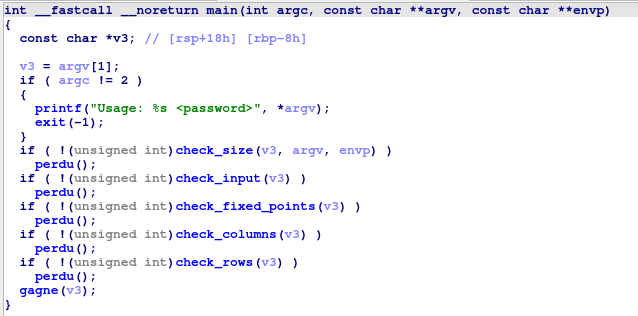
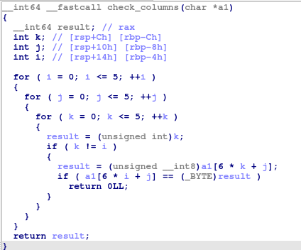
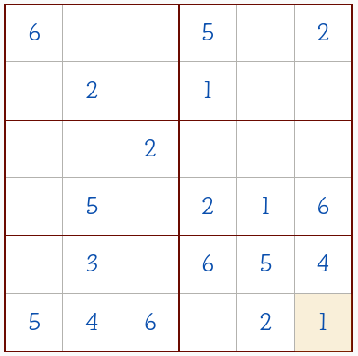

# Reverse me

Voici la fonction main

D'après la chaine de caractère, on doit donner un mot de passe en ligne de commande qui sera ensuite donné comme paramètres à plein de fonction qui vont effectuer des vérifications sur le mot de passe fourni.

La première fonction `check_size` vérifie que la taille du mot de passe est 36

La fonction `check_input` boucle sur tous les caractères et vérifie s'ils sont entre '1' et '6'.  

La fonction `check_fixed_points` effectue le check suivant `if(fixed_points[i] != -1 && a1[i] - '0' != fixed_points[i])`.  
`fixed_point` est un tableau en mémoire et toutes les valeurs différentes de -1 doivent être égales à celles de notre input.  
Cela nous permet de connaitre plusieurs valeurs de notre input.

La fonction `check_columns` est la suivante:

Dans cette fonction on accède aux éléments de notre input avec `a1[6 * i + j]`, ce qui implique que l'on traite notre input comme une matrice de 6 x 6.  
On compare chaque élément de la matrice avec `a1[6 * k + j]` avec k allant de 1 à 6.

Cette fonction vérifie si un élément se répère au sein d'une même colonne.

La fonction `check_rows` est équivalente, elle vérifie qu'aucun élément ne se répère au sein d'une même ligne.

Toutes ces contraintes peuvent nous faire penser au jeu du sudoku avec une grille 6x6 dont on connait la disposition initiale grace à la fonction `check_fixed_points`.  
Il est donc possible de résoudre le sudoku suivant à la main ou avec un solver [en ligne](https://sudokus.fr/6x6-solveur/):  

On peut aussi voir ces contraintes comme un système d'équation à N inconnues.  
Il existe des solver d'équations en python qui permettent de résoudre ce système (voir solve.py)