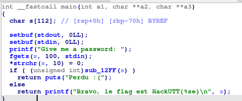
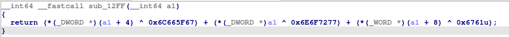
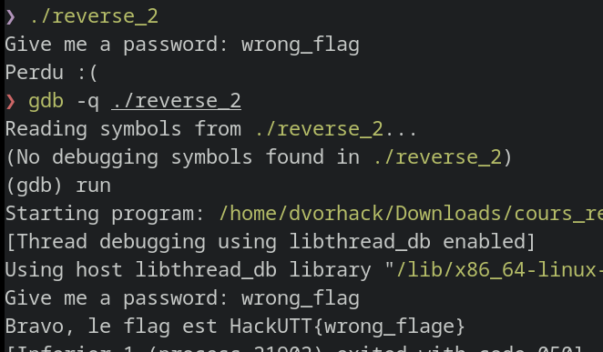
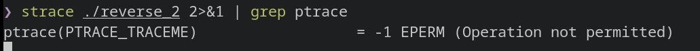
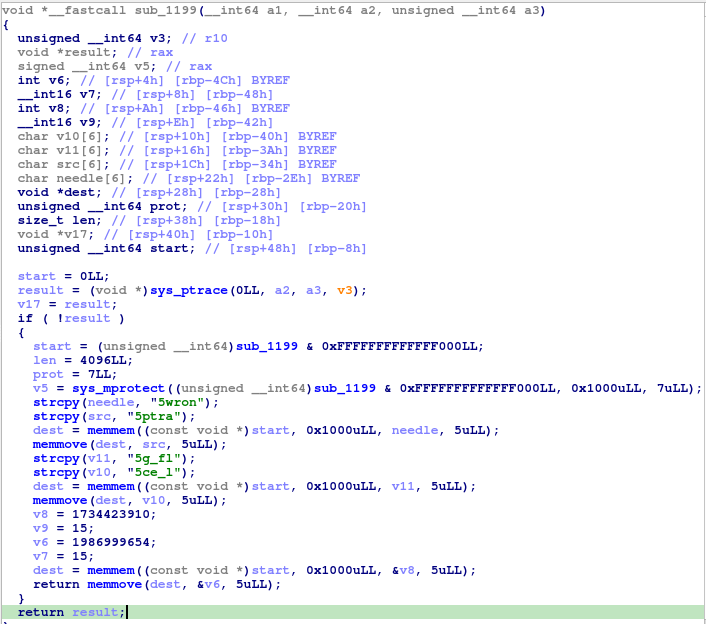
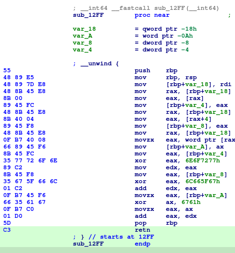
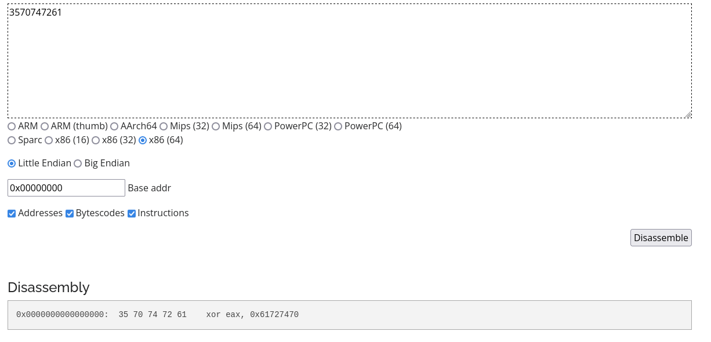

# Reverse 2

Voici la fonction main 

Le programme demande une chaine de caractère à l'utilisateur, la passe en paramètre à `sub_12FF` et l'utilise comme flag si le retour de la fonction est 0.  
Voici la fonction `sub_12FF`

Cette fonction additionne trois valeurs, étant donné que nous voulons 0 comme résultat le plus simple est d'avoir 0 dans ces 3 valeurs.  
Chaque valeur est le résultat d'un XOR entre une constante et un truc dépendant de `a1`.

`a1` est un pointeur vers notre chaine de caractère, sous entendu un pointeur vers le premier caractère de la chaine.  
Donc `a1 + 4` pointe vers le 5e caractère. Ensuite on convertis ce pointeur en `(_DWORD *)`, soit un pointeur de DWORD (32 bits).  
On voit ensuite l'utilisation de `*` qui récupère le contenu d'un pointeur (ici nos caractères 5, 6, 7, et 8).

Ces caractères sont xorrés avec la constante `0x6C665F67` et l'on souhaite que le résultat soit 0, ils doivent dont être égaux.  
De plus, nos processeurs sont de type *little-endian* ce qui signifie que lorsque l'on récupère une valeur à partir d'un pointeur on inverse tous les octets ([documentation](https://fr.wikipedia.org/wiki/Boutisme)).  
Donc notre 5e caractère est xorré avec `67`, le 6e avec `5F`, etc.

Si l'on applique ce raisonnement aux trois XOR, on trouve l'input qu'il faut: `wrong_flag`.  
Seulement si l'on essaie ce mot de passe, on perd :/

Une bonne pratique pour vérifier que l'on a bien compris le programme est de voir dans GDB si le programme se comporte comme attendu.  
Or la dans GDB, on a gagné !

Le programme arrive à voir s'il est en train de se faire débugger ou non avec gdb et semble modifier son comportement.  
Sous linux un processus ne peut être débuggé que par 1 seul processus, donc une technique pour vérifier si l'on est débuggé par gdb (ou autre débugger) est d'essayer de se debugger sois même. Si l'on y arrive alors personne ne nous débug.

Le debugging d'un processus sous linux s'effectue avec l'appel systeme [`ptrace`](https://man7.org/linux/man-pages/man2/ptrace.2.html).

On peut vérifier si ce syscall est effectué en utilisant la commande [`strace`](https://man7.org/linux/man-pages/man1/strace.1.html) qui affiche tous les syscalls effectués par un processus.

Le programme fait effectivement un syscall ptrace. On voit d'ailleurs que le résultat est `-1` car `strace` débug le processus pour afficher tous les syscalls effectués.

Il y a donc une fonction dans le binaire qui doit effectuer ce syscall.  
En regardant les fonctions une par une, on tombe sur `sub_1199` qui commence par faire un syscall avec 0x65 dans rax, aka [ptrace](https://x64.syscall.sh/)

Si le résultat est 0 (s'il n'est pas débuggé), alors il fait beaucoup de choses.  
Il commence par appeler `mprotect` pour changer les permissions de la mémoire (ici 7 -> RWX), puis il utilise à trois reprises `memmem` suivi de `memmove`.  
Cela laisse supposer qu'il cherche un emplacement en mémoire et qu'il remplace des octets à cet emplacement (potentiellement des instructions du code).  

La première fois il cherche les octets `35 77 72 6f 6e`, on peut demande à ida de chercher ces octets avec `Search -> Sequence of bytes` et cocher `Find all occurences` pour voir si il les trouves plusieurs fois.  
Ida ne trouve qu'un match dans la fonction `sub_12FF`.  
Pour voir précisement à quels octets cela correspond, on peut afficher les octets des instructions assembleur avec `Options -> General` et mettre 6 dans `Number of opcodesbytes`

On voit alors que la séquence d'octet correspond exactement à l'instruction `xor eax, 6E6F7277`.  

Après avoir trouvé cette instruction avec `memmem`, le programme la remplace par `35 70 74 72 61` avec `memmove`  
On peut utiliser un [désassembleur](https://shell-storm.org/online/Online-Assembler-and-Disassembler/) pour voir à quoi correspond cette instruction

Les octets 1, 2, 3, 4 de mon input ne sont pas 'wron' mais 'ptra'.  

En appliquant le même raisonnement sur les `memmove` suivants, on trouve alors le nouveau mot de passe: `ptrace_lov`.

La technique employée ici s'appelle du polymorphisme et est régulièrement retrouvée dans les malwares pour complexifier leur analyse et contourner les anti-virus.