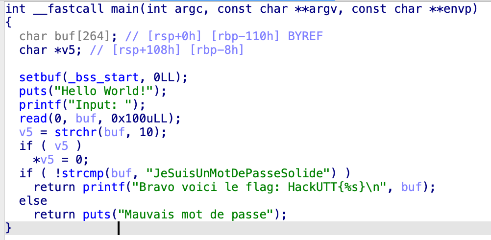

# Hello World

Voici la fonction main de ce programme

Il demande une entrée à l'utilisateur qu'il stocke dans la variable `buf`

L'entrée est ensuite comparée à `JeSuisUnMotDePasseSolide` et nous affiche le flag si ils sont égaux.