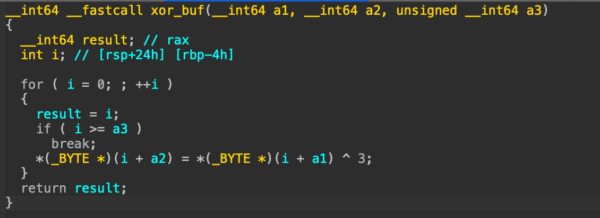

# 1 Keygen Writeup

Ce document détaille le fonctionnement du binaire et comment résoudre le challenge associé

## Analyse

### Main
On si on ouvre le binaire dans ida, voici à quoi ressemble la fonction `main`


Grâce aux chaines de caractères on peut déjà comprendre comment doit être utilisé ce binaire: il doit être lancé avec deux arguments (un username et une license)

L'énoncé indique que l'on cherche la license correspondant à l'utilisateur **admin**, il doit donc y avoir une relation entre ces deux entrées.

Dans un premier temps `argv[2]` est utilisé comme paramètre de `strtoul`.  
D'après la documentation, cela permet de convertir une chaine de caractère contenant un nombre en un int ([doc](https://linux.die.net/man/3/strtoul)).  
On trouve également dans la doc que le 3e argument de cette fonction est la base dans laquelle le nombre est encodé. Ici la base 16 est utilisée.

Nous savons donc que `argv[2]` (notre license) doit être un nombre sous forme hexadécimale.

Ensuite on récupère la taille du username avec `strlen` et on l'utilise dans la fonction `malloc` qui crée un espace mémoire de la taille demandée.

On appelle la fonction `xor_buf` avec comme paramètre le username, l'espace mémoire créé et la taille du username

Regardons maintenant ce que fait la fonction `xor_buf`

### xor_buf


IDA ne connait pas à l'avance le type des variables de la fonction mais nous pouvons l'aider car nous savoir ce qui est passé comme argument.  
On commence donc par retyper et renommer ces variables pour rentre le code plus lisible (click droit -> Set lvar type) (click droit -> Rename lvar)


Grace à ce retypage, la fonction est plus facilement lisible.  
Il s'agit d'une boucle qui parcourt `username` et place `username[i] xor 3` dans `a2[i]`

### sum_buf

Pour cette fonction, on commence également par retyper les arguments car on connait leur type


On se rend compte qu'elle a la même structure que la précédente: elle itère sur tous les éléments de `a1`.  
Mais cette fois si elle additionne tous ces éléments et retourne le résultat

La sortie de cette fonction est directement comparée avec la license que l'on a donné au programme. 

Nous avons fini d'analyser ce programme et nous savons désormais comment sont comparés nous input: tous les caractères du username sont xor avec 3 puis tous les résutats sont additionnés.

Il est temps de résoudre le challenge.

## Exploitation

Le challenge nous demande de calculer la license pour l'utilisateur `admin`.  
Or nous savons maintenant comment est calculée une license à partir d'un utilisateur.  
Il n'y a plus qu'à écrire un programmme dans le langage de son choix pour effecuer les étapes de calcul.

```python
def gen_license(username):
    # On xor tous les caractères avec 3
    buf = []
    for x in username:
        buf.append(ord(x) ^ 3)
    # On additionne tous les octets
    ret = 0
    for x in buf:
        ret += x
    return ret


username = 'admin'
license = gen_license(username)
print(hex(license))
```

On peut ensuite vérifier si notre license est valide (ne pas oublier de la mettre sous forme hexadécimale)


## Autre technique d'exploitation

En analysant la fonction main, on peut remarquer que la license que l'on cherche n'est pas modifiée (hormis le `strtoul`) avant d'être comparée.  
Ce qui signifie que si l'on arrête le programme au moment de cette comparaison, le nombre comparé à notre input est le nombre que l'on cherche. Il suffit donc d'arrêter le programme au bon endroit pour le trouver.

Pour cela, il faut aller voir comment est effectué cette comparaison en assembleur.


Le `if` correspond à l'instruction `JNZ`.  
Lors de l'instruction `CMP`, `RAX` contient la valeur calculée par la fonction `sum_buf`, l'addresse de cette instruction est **0x4012D7**.

On peut alors utiliser gdb pour récupérer cette valeur.

