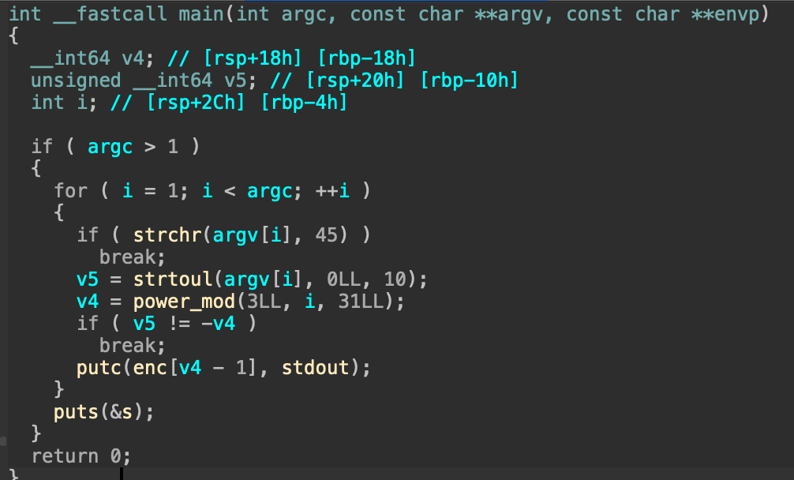
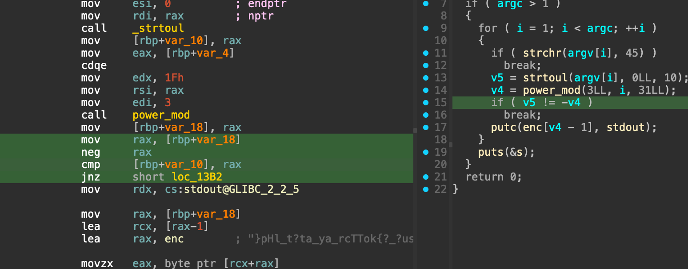
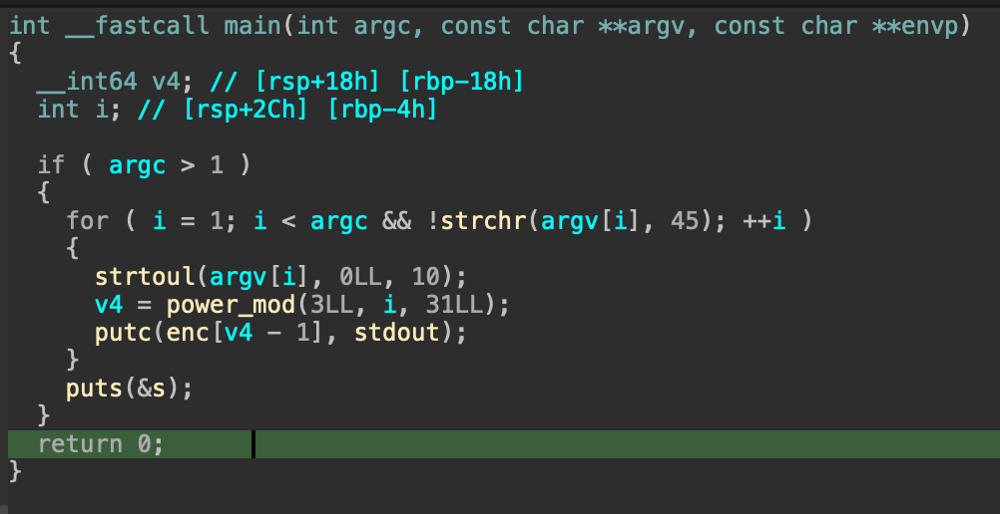

# 2 aaargs

Ce document détaille le fonctionnement du binaire et comment résoudre le challenge associé

## Analyse

Voici à quoi ressemble la fonction `main`



On commence par une vérification si argc est supérieur à 1  
Si ce n'est pas le cas le programme s'arrête, on sait donc que l'on doit donner des arguments.

Ensuite on a une boucle qui appelle `strchr` avec comme paramètre `argv[i]` (que l'on contrôlle) et 45.  
D'après la [doc](https://linux.die.net/man/3/strchr), cette fonction cherche un caractère dans une string. Renvoie un pointeur sur ce caractère s'il est trouvé sinon renvoie 0.

En C, `if( fonction() )` equivaut à `if( fonction() != 0 )`.  
Donc ici on rentre dans le if si le caractère 45 est présent dans la string.
La [table ascii](https://www.ascii-code.com/fr) nous indique que le caractère 45 est `-`.  
Si on rentre dans le if, on break donc on sort de la boucle et le programme s'arrête. Donc on ne veut pas de ce caractère dans notre input.

Ensuite on envoie cette même string dans `strtoul` qui la convertie en un nombre (cette fois ci en base 10).  
Les paramètres que l'on donne au programme sont donc des entiers positifs

Le `if` suivant compare notre entier avec `-power_mod(3, i, 31)` que l'on ne contrôlle pas mais que l'on peut calculer.
On veut qu'ils soient égaux sinon le programme s'arrête.

## Exploitation

On peut donc calculer les paramètres que l'on doit donner au programme.  
Le premier paramètre est comparé à `-power_mod(3, 1, 31)` = $-3^{1}\ mod\ 31$ = `-3`  
Le second est comparé à `-power_mod(3, 2, 31)` = $-3^{2}\ mod\ 31$ = `-9`  
etc.

Or on ne peut pas envoyer le caractère `-`.  

Cependant, notre input est envoyée dans la fonction `strtoul` qui convertie une string en un entier **non signé**.
On peut donc calculer l'équivalent de `-3` pour un entier non signé.

Le nombre `-3`, une fois stocké dans la mémoire est représenté par les octets suivants: FD FF FF FF FF FF FF FF.  
Le nombre non signé qui est représenté de la même manière en mémoire est 0xfffffffffffffffd = 18446744073709551613.  
En C, `-3 == 18446744073709551613` :D

Il n'y a plus qu'à automatiser tout ça

```python
from pwn import *

p = 31
g = 3
passwd = []
for i in range(1, p):
    x = pow(g,i,p)
    passwd.append(str((2**64)-x))

io = process(['../dist/2_aaargs'] + passwd)

print(io.recvall())

```

Fun fact: ceci est un générateur de groupe de cyclic multiplicatif, un principe mathématique très utilisé en cryptographie (Notamment dans RSA) ;)

## Autre technique d'exploitation

En regardant la fonction main, on se rend compte que l'affichage du flag de dépend pas de l'input utilisateur.  
Il faut juste que l'on soit capable de passer ce `if`.  

Or rien ne nous empêche de modifier le binaire pour retirer le `if` !

Pour ça, il faut aller voir comment ça se passe niveau assemleur



L'instruction `JNZ` saute à la fin du programme si les opérandes de `CMP` ne sont pas égales.  
On peut donc modifier cette insruction par un `NOP`

Le désassemblé ressemble alors à ça



Et le flag sera affiché peu importe l'input