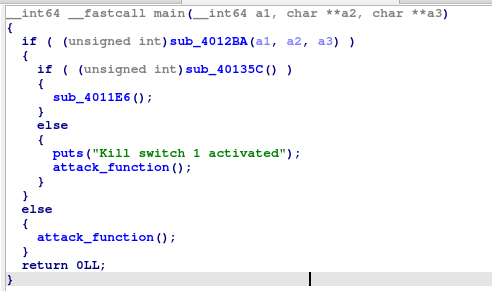
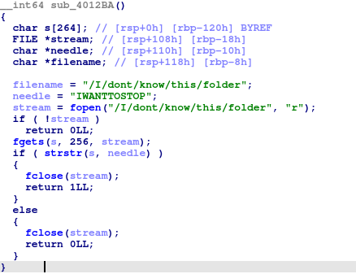
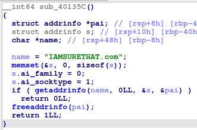

# Simplekill

D'après l'énnoncé, l'objectif est de trouver le killswitch implémenté dans le binaire pour arrêter le fonctionnement de ce malware.

Lorsqu'on l'exécute, plein de choses s'affichent dans le terminal suivi de la chaine `TODO: attack function`.  
Nous allons utiliser cette chaine pour commencer notre reverse.

Une fois dans ida, on peut afficher l'ensemble de chaine de caractère reconnues en allant dans `View->Open subviews->Strings`. Un double click dessus permet d'aller à son emplacement en mémoire.  
On peut ensuite voir où elle est utilisée avec ses xref `click droit->Jump to xref to operande`.  
On suppose alors que la fonction dans laquelle elle est utilisée est la fonction malveillante.

On peut ensuite voir où cette fonction est utilisée en allant voir ses xref (même procédure que pour les string).  
Elle est seulement utilisée dans le `main`



Le flag est affché dans la fonction `sub_4011E6`, on suppose alors que c'est la que l'on veut aller.  
Pour cela, il faut que les fonctions `sub_4012BA` et `sub_40135C` retournent 1

Voici la fonction `sub_4012BA`



Pour que cette fonction retourne 1, il faut que le fichier `/I/dont/know/this/folder` existe et qu'il contienne `IWANTTOSTOP`


Voici la fonction `sub_40135C`



Pour que cette fonction retourne 1, il faut que le nom de domaine `IAMSURETHAT.com` existe.  
La manière la plus simple de faire ça en local est d'utiliser le fichier `/etc/hosts`.

Pour mettre cet environnement en place, j'utilise docker

```bash
docker run --rm -it -v ./1_chal:/1_chal ubuntu:22.04

# Puis dans le docker
mkdir -p /I/dont/know/this && echo "IWANTTOSTOP" > /I/dont/know/this/folder
echo "127.0.0.1 IAMSURETHAT.com" >> /etc/hosts
/1_chal
```