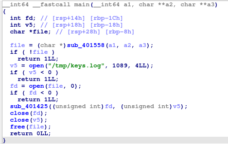
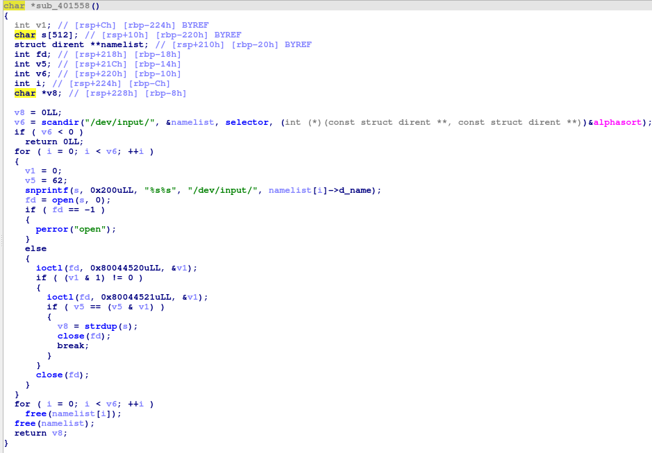
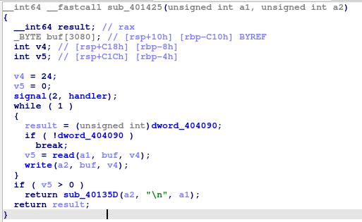

# Malware

Cette fois ci pas d'informations sur le type de malware auquel on a affaire, on commence donc par analyser le main




La valeur de retour de la première fonction appellée a l'air important, on va donc l'analyser



Cette fonction en recherche un périphérique d'entrée spécifique dans le répertoire `/dev/input/`, vérifie ses caractéristiques à l'aide des appels ioctl, puis renvoie le chemin du périphérique trouvé sous forme de chaîne de caractères.

D'après des recherches internet, on peut supposer que le périphérique recherché est un clavier ou une souris.

La fonction main `open` ce prérphérique et `/tmp/keys.log` et les donne à `sub_401425`




Cette fonction met en place un handler de signal puis effectue une boucle où elle transfère de la donnée depuis le clavier/souris vers le fichier de log.  
Cette boucle s'arrête lorsque la variable globale `dword_404090` vaut 0. Or par défaut elle faut 1.

En regardant les xref on voit que la seule fonction qui écrit dans cette variable est la fonction `handler` qui correspond au handler de signal.  
Elle correspond au signal numéro 2 (premier argument de la fonction `signal`) qui d'après la [doc](https://manpages.ubuntu.com/manpages/focal/man7/signal.7.html) est le signal `SIGINT`.  
Or `SIGINT` est le signal envoyé au programme lorsque l'on fait un `CTRL+C`.

Donc ce programme récupère des input clavier en boucle tant que l'on de l'arrête pas.  
Il s'agit d'un keylogger.

Le fichier `keys.log` est disponible sur le serveur, il n'y a plus qu'à interpréter son contenu.  
D'après la [documentation](https://docs.kernel.org/driver-api/input.html), il s'agit d'un ensemble de données dont la structure est relativement basique:  
```c
struct input_value {
    __u16 type;
    __u16 code;
    __s32 value;
};
``` 

On peut coder un programme pour convertir ces structures en touche de clavier (voir exploit.py)