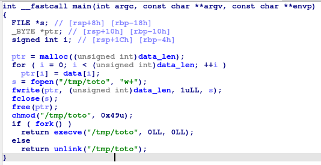

# Packer

Voici la fonction `main`



Le programme effectue un XOR avec un grad tableau de données avant d'écrire le résultat dans le fichier `/tmp/toto`.  
Il rend ensuite ce fichier executable et l'execute.

Cependant, avant l'execution, il utilise la fonction `fork` qui clone le processus actuel.  
L'un de ces deux process execute `/tmp/toto` alors que le second le supprime.

Notre but dans un premier temps est de récupérer ce fchier.  
Pour cela on peut faire la même chose que le binaire à savoir XOR le tableau et écrire le résultat dans un fichier.  
Ou alors on lance le binaire dans gdb et on break puis kill le process avant qu'il ai eu le temps de supprimer `/tmp/toto`.

Ce fichier est également un executable ELF, on le lance dans ida


Ce programme n'utilise aucune fonction de librairie partagée et effectue directement des syscall, il a surement été écrit en assembleur.

L'input utilisateur est sockée dans la variable `byte_40203C`.  
Un premier `do while` effectue un XOR entre chaque caractère de notre input avec 0xAA.

Le second `while` effectue une comparaison entre notre input xorré et `byte_402000` qui est un tableau en mémoire 

```python
flag = ''

tab = bytes.fromhex('E2CBC9C1FFFEFED1E3F5CBC7F5DEC2CFF5DACBC9C1CFD8D7')

for x in tab:
    flag += chr(x ^ 0xAA)

print(flag)
```