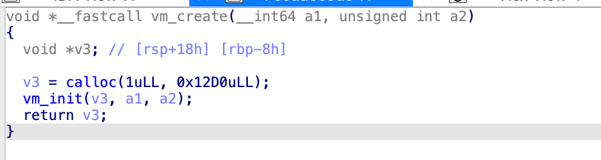

# VM

D'après l'énnoncé du challenge, on se doute que l'on va avoir affaire à une VM.  
Généralement une VM simule le fonctionnement d'un processeur, elle va avoir une zone de mémoire où elle stocke son code assembleur, potentiellement des registres, une stack, etc.  
En revanche elle n'est pas contrainte de simuler le fonctionnement d'un processeur connu, elle peut avoir un langage assembleur custom et même un fonctionnement complètement différent.

En général, le point de départ d'un reverse de VM est ce que l'on appelle le dispatcher. 
Il s'agit du code qui va traiter une instruction assembleur de la VM. On retrouve généralement un gros switch-case, qui permet d'effectuer le code associé à chaque instruction.

On va se balader des les fonctions de notre binaire pour le trouver.

Dans la fonction `vm_exec`, on trouve effectivement un gros switch case

La variable `i` serait donc une instruction assembleur de la VM.

Ce switch-case est dans une boucle `for` et `i` est définie à chaque tour de boucle: `i = *(_DWORD *)(4LL * v33 + *(_QWORD *)a1)`.  
L'instruction récupérée dépend de `a1` (paramètre donné à la fonction) et `v33`.  
Parmis ces deux variables, l'une devrait être le tableau contenant les instructions assembleurs et l'autre le registre RIP de notre VM.
`a1` n'est pas modifiée dans la fonction alors que `v33` est incrémenté à chaque tour de boucle et modifié dans quelques `case` donc il ressemble plus à `RIP`.

Cherchons maintenant d'où provient `a1`.  
`vm_exec` n'est appelée que dans `main`

Il s'agit du retour de fonction de `vm_create`

Cette fonction appelle juste `calloc` (équivalent à `malloc`) puis appelle `vm_init`

On voit ici que l'on accède à plusieurs données avec une adresse relative à `a1` (`*a1`, `a1+8`, `a1 + 502`).
Cela signifie que `a1` est traitée comme une strucure dont on accède à certains de ses champs.

IDA permet de faciliter le reverse en recréant cette structure.  
Pour ça on va dans `View -> Open sub-view -> Local types` puis `Click droit -> add Type -> Onglet struct`.  
`a1` pointe vers une zone mémoire de taille 0x12D0 donc peut supposer que c'est également la taille de notre structure.

Nous ne connaissons pas le type des champs de notre structure donc dans un premier temps, j'aime la remplir de char.  
Pour ça je définis le premier comme étant un char

Puis `click droit -> Array`, faire la taille de la structure et décocher `Create as array`

On peut ensuite appliquer ce nouveau type à notre variable

De cette manière on voit que l'on accède à des champs précis de la structure que l'on va pouvoir renommer et retyper

`field_0` a l'air d'être un `long`  
`field_8` a l'air d'être un `int`  
`field_FB0` a l'air d'être un tableau de 100 pointeurs `void *[100]`

mais je ne sais pas encore à quoi ils servent.  
Les pointeurs dans `field_FB0` pointent vers des zones mémoire de taille 0x2C, pour l'instant je ne sais pas encore ce qui est stocké dedans mais si il s'agit également d'une structure je pourrai utiliser la même technique qu'à l'instant.

Maintenant que ma structure de VM est créée, je peux retourner dans `vm_exec` qui est la seule fonction qui a l'air de faire des choses intéressantes.  
J'en profite pour retyper `a1`

On voit maintenant que les instructions assembleurs de la VM proviennent de `a1->field_0` (que je retype comme un `_DWORD *`)

Maintenant si je regarde les bornes de ma boucle, au premier tour, l'instruction assembler est récupérée de `a1->code_asm[a2]`. Donc `a2` a l'air d'être le point d'entrée du programme.  
La condition de sortie de la boucle est `if ( RIP >= (int)result )` où `result = a1->field_8;`. Donc `field_8` est le point de sortie du programme.

Si l'on regarde les 4 premiers `case`, on remarque un pattern ce dessiner.  
Ils récupèrents deux valeurs, font un calcul et stockent le résultat dans `field_C + v32`.  
`field_C` est traité comme un tableau de int, `v32` est son index et est automatiquement décrémenté. Cela ressemble à la stack et `RSP`.  
Comme je ne connais pas la taille du tableau `field_C`, je donne à IDA le type `int[1]` pour lui indiquer qu'il s'agit d'un tableau mais pour être sur de ne pas empiéter sur les champs suivants

Le code est maintenant un peu plus lisible et l'on peut commencer à faire des suppositions sur le fonctionnement de certaines instructions.

L'instruction **1** récupère 2 valeurs sur la stack et stocke la somme sur la stack  
L'instruction **2** récupère 2 valeurs sur la stack et stocke la différence sur la stack  
...

L'instruction **5** récupère 2 valeurs sur la stack et stocke sur la stack 1 ou 0 en fonction de si elles sont égales ou non  
L'instruction **6** place la valeur `a1->code_asm[RIP]` dans `RIP`. Donc cette instruction a un argument et cet argument est placé dans `RIP`, il s'agit d'un jump.  
L'instruction **7** effectue un jump si 1 est stocké sur la stack. Il s'agit d'un jump conditionnel.  

L'instruction **18** récupère une valeur qui dépend de `field_FB0` et `v31`, place cette valeur dans `RIP` et décrémente `v31`; ça ressemble à un `RET`

L'instruction **19** stocke des choses dans `field_FB0[v31]`, incrémente `v31`, décrémente `RSP` et modifie `RIP`; ça ressemble à un `CALL`

Maintenant que l'on comprend(partiellement) certaines instructions, on va pouvoir écrire un désassembleur. (voir disassembler.py)

Nous n'avons pas encore une vision complète sur le fonctionnement de la VM (notemment le champ `field_FB0`), mais avec ce désassemblé on peut faire des suppositions pour comprendre ce que fait le programme.

Le point d'entrée est 0x14 (2e argument de `vm_exec`).  
On voit dans un premier temps un enchainement de 4 `Load CONST`, `PUTC` qui permettent d'afficher "IN: " à l'écran.  
Puis il y a un GETC qui demande à l'utilisateur un nombre.

Il y a ensuite deux appels de fonctions.  
La première est à l'adresse 0, elle ajoute 2 à l'argument que l'on lui fourni  
La seconde est à l'adresse 0xA, elle multiplie son argument par 7.

Suite à cela, on compare le résultat avec 0xcc07C9.  
Si ils sont égaux on chaine des `Load CONST`, `PUTC` qui affichent `gagne`, sinon on affiche `perdu`.

On est donc capable de calculer le nombre attendu: `(0xcc07C9/7)-2`.
